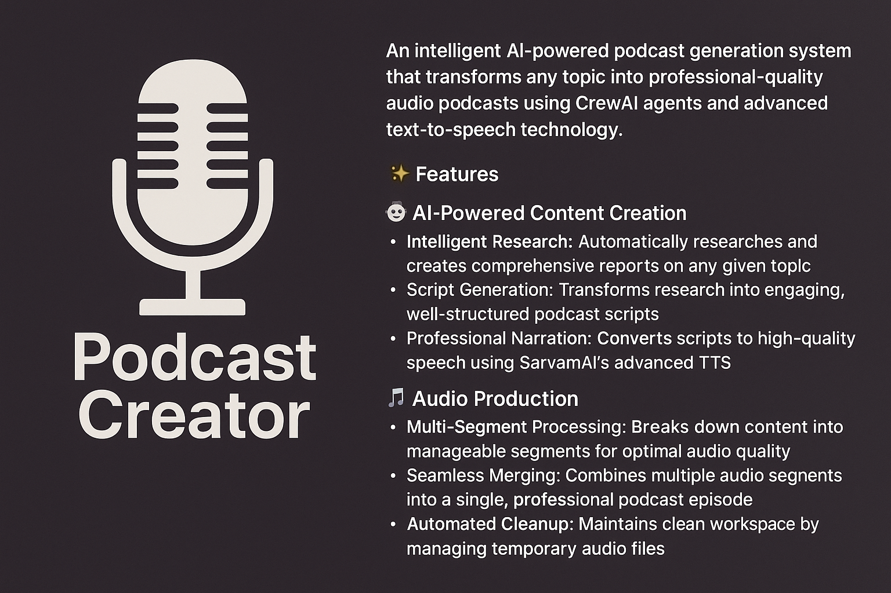

# 🎙️ PodcastCreator


An intelligent AI-powered podcast generation system that transforms any topic into professional-quality audio podcasts using CrewAI agents and advanced text-to-speech technology.

## ✨ Features

### 🤖 AI-Powered Content Creation
- **Intelligent Research**: Automatically researches and creates comprehensive reports on any given topic
- **Script Generation**: Transforms research into engaging, well-structured podcast scripts
- **Professional Narration**: Converts scripts to high-quality speech using SarvamAI's advanced TTS

### 🎵 Audio Production
- **Multi-Segment Processing**: Breaks down content into manageable segments for optimal audio quality
- **Seamless Merging**: Combines multiple audio segments into a single, professional podcast episode
- **Automated Cleanup**: Maintains clean workspace by managing temporary audio files

### 🔧 Smart Workflow
- **Sequential Processing**: Follows a logical workflow from research → scripting → audio production
- **Error Handling**: Robust error management throughout the entire pipeline
- **Flexible Topics**: Supports any topic for podcast creation

## 🛠️ Core Tools

### 1. **TextToSpeechTool** 🗣️
- **Provider**: SarvamAI API with Bulbul v2 model
- **Voice**: Anushka (English-Indian accent)
- **Capability**: Converts text segments to high-quality WAV audio files
- **Features**: Batch processing of multiple text segments

### 2. **MergeAudioTool** 🎵
- **Technology**: PyDub audio processing
- **Function**: Merges multiple WAV files into a single podcast episode
- **Features**: Automatic file sorting and seamless audio concatenation

### 3. **CleanWavFilesTool** 🧹
- **Purpose**: Workspace management and cleanup
- **Function**: Removes temporary audio files while preserving the final podcast
- **Benefits**: Maintains clean directory structure

## 🤵 AI Agents

### 📝 Podcast Creator Agent
- **Role**: Content researcher and script writer
- **Responsibilities**:
  - Creates comprehensive topic reports (max 2500 characters)
  - Develops engaging podcast scripts
  - Segments content for optimal audio production
- **Expertise**: Research, content structuring, and storytelling

### 🎬 Podcast Producer Agent
- **Role**: Audio production specialist
- **Responsibilities**:
  - Converts scripts to professional audio
  - Manages audio merging and post-production
  - Ensures seamless final output
- **Tools**: All audio processing tools (TTS, Merger, Cleaner)

## 🎯 Usage

### Basic Workflow
1. **Topic Input**: Provide any topic of interest (default: "AI LLMs")
2. **Research Phase**: AI agent researches and creates a comprehensive report
3. **Script Development**: Content is transformed into podcast-ready segments
4. **Audio Generation**: Each segment is converted to speech
5. **Final Production**: All segments are merged into a complete podcast


## 📁 Project Structure

```
src/podcastcreator/
├── __init__.py
├── main.py              # Entry point and command handlers
├── crew.py              # CrewAI agents and tasks configuration
├── config/
│   ├── agents.yaml      # Agent definitions and roles
│   └── tasks.yaml       # Task descriptions and workflows
└── tools/
    ├── __init__.py
    ├── sarvamtts_tool.py     # Text-to-speech conversion
    ├── audiomerger_tool.py   # Audio file merging
    └── cleanwaw_tool.py      # File cleanup management
```

## 🌟 Key Capabilities

### Content Intelligence
- **Dynamic Research**: Adapts to any topic with contextual understanding
- **Year-Aware**: Incorporates current year context for relevant content
- **Structured Output**: Produces well-organized, flow-optimized scripts

### Audio Quality
- **Professional Voice**: Uses high-quality Indian-English TTS
- **Segment Optimization**: Breaks content into 500-1000 character segments for optimal audio quality
- **Seamless Integration**: Produces natural-sounding, continuous audio

### Automation
- **End-to-End Processing**: Complete automation from topic to finished podcast
- **Error Recovery**: Robust handling of API failures and processing errors
- **Clean Workflow**: Automated cleanup ensures no leftover temporary files

## 🎨 Customization Options

- **Topic Flexibility**: Generate podcasts on any subject matter
- **Voice Selection**: Currently uses Anushka voice (expandable to other voices)
- **Content Length**: Configurable report and segment lengths
- **Audio Format**: Outputs in WAV format (convertible to other formats)

## 📈 Performance Features

- **Batch Processing**: Handles multiple text segments efficiently
- **Memory Management**: Smart cleanup prevents disk space issues
- **Scalable Architecture**: CrewAI framework allows easy expansion

---

**Note**: This system requires API access to SarvamAI for text-to-speech functionality and uses CrewAI for orchestrating the AI agents workflow.
